# Travel Agent MCP Architecture

## System Overview

This is a Model Context Protocol (MCP) based travel planning system that provides intelligent travel assistance through a multi-step automated workflow. The system integrates various external APIs to create comprehensive travel plans including weather, flights, accommodations, attractions, restaurants, and translations.

## Architecture Diagram

```mermaid
graph TB
    %% External Layer
    subgraph "External APIs"
        WeatherAPI[OpenWeatherMap API<br/>🌤️ Weather Data]
        PlacesAPI[Google Places API<br/>🏨 Hotels & Attractions]
        TranslationAPI[DeepL API<br/>🌐 Translation Service]
        FlightAPI[Amadeus API<br/>✈️ Flight Search]
    end

    %% Client Layer
    subgraph "Client Layer"
        WebUI[Web Interface<br/>📱 HTML/CSS/JS]
        TestClient[Test Client<br/>🧪 MCP Client]
    end

    %% MCP Protocol Layer
    subgraph "MCP Protocol Layer"
        MCPTransport[Stdio Transport<br/>📡 Communication]
        MCPClient[MCP Client<br/>🔌 Protocol Handler]
        MCPServer[MCP Server<br/>🛠️ Tool Provider]
    end

    %% Core Business Logic
    subgraph "Core Business Logic"
        TravelPlanner[Travel Planner Engine<br/>🧠 Planning Logic]
        APIService[API Service<br/>🔗 External Integration]
        CacheManager[Cache Manager<br/>💾 Data Caching]
    end

    %% Configuration
    subgraph "Configuration"
        APIConfig[API Configuration<br/>⚙️ Settings & Keys]
    end

    %% Data Flow
    WebUI -->|User Input| MCPClient
    TestClient -->|Test Requests| MCPClient
    MCPClient -->|MCP Protocol| MCPTransport
    MCPTransport -->|Tool Calls| MCPServer
    
    MCPServer -->|Delegate| TravelPlanner
    TravelPlanner -->|API Calls| APIService
    APIService -->|Cache Check| CacheManager
    APIService -->|HTTP Requests| WeatherAPI
    APIService -->|HTTP Requests| PlacesAPI
    APIService -->|HTTP Requests| TranslationAPI
    APIService -->|HTTP Requests| FlightAPI
    
    APIService -->|Configuration| APIConfig
    CacheManager -->|Configuration| APIConfig

    %% Response Flow
    APIService -->|Cached/API Data| TravelPlanner
    TravelPlanner -->|Travel Plan| MCPServer
    MCPServer -->|MCP Response| MCPTransport
    MCPTransport -->|Results| MCPClient
    MCPClient -->|Display| WebUI
    MCPClient -->|Test Output| TestClient

    %% Styling
    classDef external fill:#e1f5fe,stroke:#01579b,stroke-width:2px
    classDef client fill:#f3e5f5,stroke:#4a148c,stroke-width:2px
    classDef mcp fill:#e8f5e8,stroke:#1b5e20,stroke-width:2px
    classDef core fill:#fff3e0,stroke:#e65100,stroke-width:2px
    classDef config fill:#fce4ec,stroke:#880e4f,stroke-width:2px

    class WeatherAPI,PlacesAPI,TranslationAPI,FlightAPI external
    class WebUI,TestClient client
    class MCPTransport,MCPClient,MCPServer mcp
    class TravelPlanner,APIService,CacheManager core
    class APIConfig config
```

## Component Details

### 1. MCP Protocol Layer
- **MCP Server** (`mcp-server.js`): Implements the Model Context Protocol server
  - Provides 6 tools: `create_travel_plan`, `get_weather`, `search_places`, `search_flights`, `translate`, `optimize_plan`
  - Exposes 2 resources: `travel://current-plan`, `travel://cache-stats`
  - Handles tool calls and resource requests via MCP protocol

- **MCP Client** (`test-mcp-client.js`): Test client for MCP server
  - Demonstrates MCP protocol usage
  - Tests all available tools and resources

- **Stdio Transport**: Communication layer between client and server

### 2. Core Business Logic
- **Travel Planner Engine** (`planner-engine.js`): Main orchestration logic
  - Creates comprehensive travel plans through 8-step process
  - Generates detailed itineraries with day-by-day activities
  - Calculates budget estimates based on travel style
  - Optimizes existing plans based on user preferences

- **API Service** (`api-service.js`): External API integration layer
  - Weather data from OpenWeatherMap
  - Places search (hotels, attractions, restaurants)
  - Flight search (simulated)
  - Translation services (simulated)
  - Implements caching for all API calls

- **Cache Manager** (`cache-manager.js`): Data caching system
  - LRU cache with configurable TTL
  - Reduces API calls and improves performance
  - Configurable cache size and expiration

### 3. Client Layer
- **Web Interface** (`client/`): User-facing web application
  - Interactive form for travel preferences
  - Real-time progress tracking
  - Step-by-step visualization of planning process
  - Results display with rich formatting

- **Test Client**: Automated testing and demonstration

### 4. Configuration
- **API Configuration** (`config/api-config.js`): Centralized configuration
  - API keys and endpoints
  - Cache settings
  - Environment variable support

## Data Flow

1. **User Input**: User fills travel form in web interface
2. **MCP Request**: Client sends MCP tool call to create travel plan
3. **Planning Process**: Travel Planner Engine executes 8-step workflow:
   - Get weather information
   - Search flights
   - Find hotels
   - Search attractions
   - Find restaurants
   - Generate itinerary
   - Prepare translations
   - Calculate budget
4. **API Integration**: Each step calls appropriate external APIs through API Service
5. **Caching**: All API responses are cached for performance
6. **Response**: Complete travel plan returned to client
7. **Display**: Web interface presents formatted results to user

## Key Features

- **Multi-step Automation**: 8-step automated travel planning process
- **External API Integration**: Weather, places, flights, translations
- **Intelligent Caching**: Reduces API calls and improves performance
- **MCP Protocol Compliance**: Standardized tool and resource interface
- **Real-time Progress**: Visual progress tracking for users
- **Budget Optimization**: Dynamic budget calculation based on preferences
- **Plan Optimization**: Ability to refine existing travel plans

## Technology Stack

- **Backend**: Node.js with ES modules
- **MCP Framework**: @modelcontextprotocol/sdk
- **HTTP Client**: Axios for API calls
- **Caching**: Custom LRU cache implementation
- **Frontend**: Vanilla HTML/CSS/JavaScript
- **Configuration**: Environment variables with dotenv

This architecture provides a scalable, maintainable travel planning system that leverages the MCP protocol for standardized AI tool integration while maintaining separation of concerns and efficient data management.
